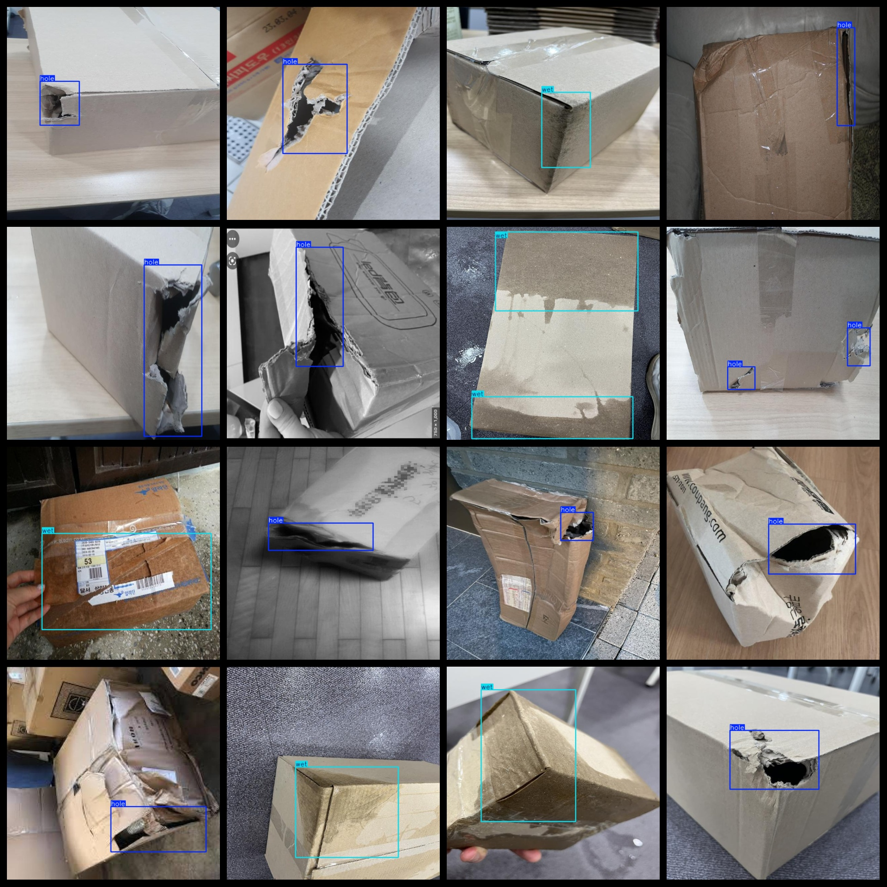
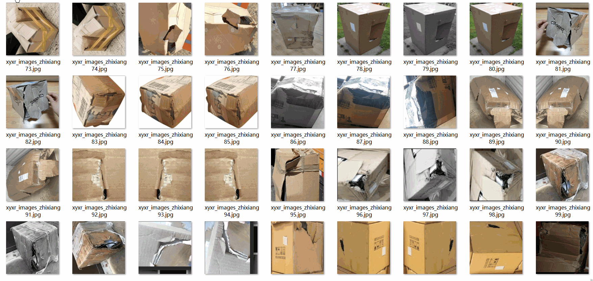

# Carton Breakage Wet Water Detection Dataset 3322 imagesVOC+YOLO format

Carton hole wet water detection dataset 3322 sheets VOC + YOLO format

Dataset format: Pascal VOC format + YOLO format (the txt file does not contain the split path, it only contains jpg images and corresponding VOC format xml files and yolo format txt files)

Number of images (number of jpg files): 3322

Number of XML files: 3322

Number of txt files: 3322

Label count: 2

The Github repository is: datasets_sl

["hole","wet"]

Number of boxes labeled in each category:

【4173】

Wet frame count = 1491

Total frames: 5664

Number of images per category:

Holes occupied by images = 2512

Wet-possessed image count = 956

Image resolution: 640x640

Use the labeling tool: labelImg

Dataset Augmentation: Yes

Rules for annotation: Draw a rectangle around the category.

Important note: The dataset does not have been divided into training, validation, and testing sets.

Special Disclaimer: This dataset does not guarantee the accuracy of the trained models or weight files.

Annotation and image details are as follows:

## Images

---

Here is a pay link on Stripe (https://buy.stripe.com/3cs8yP7sY87d0vu9AB). Please contact me lonlonago@foxmail.com after funding $89, and I will send you a complete data files, thank you!

